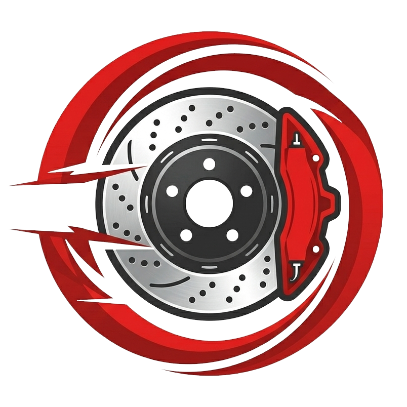
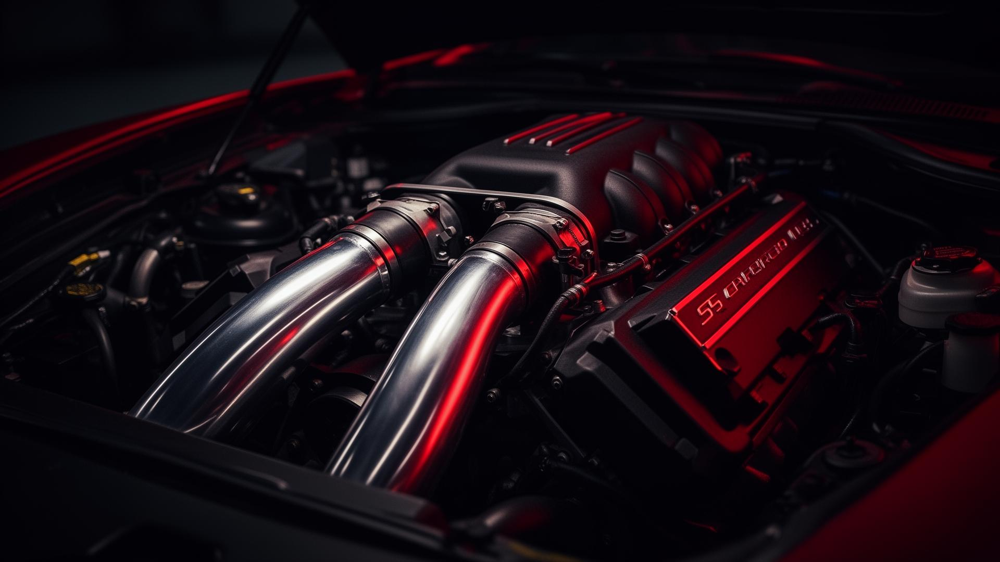

<div align="center">



# Torque Dynamics

### Modern automotive e-commerce, built for performance.

A full-stack, headless automotive commerce platform built with **Next.js**, **Medusa**, **TypeScript**, and a modern cloud-native infrastructure.

<p>
  <a href="https://torque-dynamics.vercel.app">
    
  </a>
  <a href="https://github.com/Zenypher/Torque-Dynamics">
    
  </a>
</p>

<p>
  
  
  
</p>

<br />



</div>

---

## 🚗 About

**Torque Dynamics** is a full-stack automotive e-commerce platform designed around a modern **headless commerce architecture**.

The project separates the customer-facing experience from the commerce engine, allowing the storefront and backend to evolve independently while sharing a robust commerce foundation.

The platform is built around:

- **Next.js 15** for the storefront
- **React 19** for the UI
- **Medusa v2** for commerce operations
- **PostgreSQL** for persistent data
- **Meilisearch** for fast product search
- **Stripe** for payments
- **Redis** for caching and infrastructure
- **Cloudflare R2** for media storage
- **Docker** for reproducible environments

The repository is organized into independent `backend` and `storefront` applications.

---

## ✨ Features

<table>
<tr>
<td width="50%">

### 🛒 Modern Storefront

A responsive Next.js storefront designed around a fast, modern shopping experience.

- Product discovery
- Product detail pages
- Collections
- Shopping cart
- Checkout
- Customer accounts
- Order history

</td>
<td width="50%">
  
### ⚡ Headless Commerce

Medusa powers the commerce layer independently from the frontend.

- Product management
- Cart management
- Customer management
- Order processing
- Payment providers
- Extensible modules

</td>
</tr>

<tr>
<td width="50%">

### 🔎 Powerful Search

Meilisearch provides fast, typo-tolerant product search.

- Instant search
- Product indexing
- Search filtering
- Scalable architecture
- Dedicated search infrastructure

</td>
<td width="50%">

### 💳 Payments

Stripe is integrated into the checkout flow.

- Secure payment processing
- Stripe Elements
- Test/live environments
- Headless payment architecture

</td>
</tr>

<tr>
<td width="50%">

### 🖼️ Media Infrastructure

Product and application media can be stored using S3-compatible object storage.

- Cloudflare R2
- S3-compatible APIs
- CDN-friendly assets
- Environment-based configuration

</td>
<td width="50%">

### 🐳 Containerized

Development and production environments can be deployed using Docker Compose.

- Development containers
- Production containers
- Environment templates
- Reproducible deployments

</td>
</tr>
</table>

---

# 🎬 Demo

<div align="center">

### Live Application

**[→ Open Torque Dynamics](https://torque-dynamics.vercel.app)**

</div>

The project is deployed as a production-oriented web application with a dedicated commerce backend and Next.js storefront.

> **Note:** The live demo may depend on the availability and configuration of its external services.

---

# 🖥️ Screenshots

### Storefront


---

# 🛠️ Tech Stack

## Frontend

| Technology                 | Role                  |
| -------------------------- | --------------------- |
| **Next.js 15**             | Application framework |
| **React 19**               | UI                    |
| **TypeScript**             | Type safety           |
| **Tailwind CSS**           | Styling               |
| **Medusa JS SDK**          | Commerce API          |
| **Stripe.js**              | Payments              |
| **React InstantSearch**    | Search                |
| **Radix UI / Headless UI** | UI primitives         |
| **Lucide**                 | Icons                 |

The storefront currently uses Next.js 15 and the App Router-oriented Medusa starter architecture.

## Backend

| Technology                | Role                |
| ------------------------- | ------------------- |
| **Medusa v2**             | Commerce engine     |
| **Node.js 20+**           | Runtime             |
| **TypeScript**            | Backend development |
| **PostgreSQL**            | Database            |
| **Redis**                 | Caching             |
| **Meilisearch**           | Search              |
| **Stripe**                | Payments            |
| **S3-compatible storage** | Media               |
| **OpenTelemetry**         | Observability       |
| **Sentry**                | Error monitoring    |

The backend is structured as a Medusa v2 application with source modules, API routes, jobs, integration tests, configuration, and Docker support.

---

# 🚀 Getting Started

## Prerequisites

Make sure you have:

- Node.js **20+**
- pnpm
- Docker
- Docker Compose
- Git

---

## 1. Clone

```bash
git clone https://github.com/Zenypher/Torque-Dynamics.git
cd Torque-Dynamics
```

---

## 2. Configure environment variables

For Docker development:

```bash
cp .env.docker.template .env
```

Then configure the required services.

Typical configuration includes:

```env
DATABASE_URL=
REDIS_URL=

MEILISEARCH_HOST=
MEILISEARCH_API_KEY=

S3_ENDPOINT=
S3_ACCESS_KEY_ID=
S3_SECRET_ACCESS_KEY=
S3_BUCKET=
S3_REGION=
S3_FILE_URL=

STRIPE_API_KEY=
NEXT_PUBLIC_STRIPE_KEY=

JWT_SECRET=
COOKIE_SECRET=
```

---

## 3. Start with Docker

```bash
docker compose up -d --build
```

Then open:

| Application     | URL                       |
| --------------- | ------------------------- |
| 🛍️ Storefront   | http://localhost:8000     |
| ⚙️ Medusa API   | http://localhost:9000     |
| 🛠️ Medusa Admin | http://localhost:9000/app |

---

## 4. Run without Docker

### Backend

```bash
cd backend
pnpm install
pnpm dev
```

### Storefront

In another terminal:

```bash
cd storefront
pnpm install
pnpm dev
```

The storefront is configured around port `8000`.

---

# 🧪 Testing

The backend includes both unit and integration testing configurations.

### Unit tests

```bash
cd backend
pnpm run test:unit
```

### HTTP integration tests

```bash
pnpm run test:integration:http
```

### Module integration tests

```bash
pnpm run test:integration:modules
```

---

# 📦 Deployment

Torque Dynamics supports containerized production deployment.

Create your production environment:

```bash
cp .env.prod.example .env.prod
```

Then configure your production services and start the stack:

```bash
docker compose \
  -f docker-compose.prod.yml \
  --env-file .env.prod \
  up -d --build
```

---

# 🗺️ Roadmap

Torque Dynamics is designed to evolve into a complete automotive commerce platform.

### 🛍️ Commerce

- [x] Product catalog
- [x] Collections
- [x] Shopping cart
- [x] Checkout
- [x] Customer accounts
- [x] Order management
- [x] Stripe integration

### 🔎 Discovery

- [x] Product search
- [ ] Advanced filtering
- [ ] Vehicle compatibility search
- [ ] Product comparison
- [ ] Smart recommendations

### 👤 Customer Experience

- [x] Customer authentication
- [x] Account management
- [x] Order history
- [ ] Wishlist
- [ ] Saved vehicles
- [ ] Order tracking

### ⚙️ Platform

- [x] Headless architecture
- [x] Docker development environment
- [x] Production Docker configuration
- [x] Cloud storage integration
- [x] Search infrastructure
- [ ] CI/CD pipeline
- [ ] Expanded automated test coverage
- [ ] Performance monitoring dashboard

---

# 📚 Documentation

Additional documentation is available in the repository:

- [`README.docker.md`](./README.docker.md) — Docker setup and deployment
- [`EXTERNAL_SERVICES.md`](./EXTERNAL_SERVICES.md) — External service configuration
- [`backend/README.md`](./backend/README.md) — Medusa backend information
- [`storefront/README.md`](./storefront/README.md) — Storefront information

---

# 🤝 Contributing

Contributions, ideas, and improvements are welcome.

### Development workflow

```bash
git checkout -b feature/my-feature
```

Make your changes, test them, and commit:

```bash
git add .
git commit -m "feat: add my feature"
```

Push your branch:

```bash
git push origin feature/my-feature
```

Then open a Pull Request.

---

# 📄 License

This project is licensed under the **MIT License**.

See [`storefront/LICENSE`](./storefront/LICENSE) for the complete license text.

